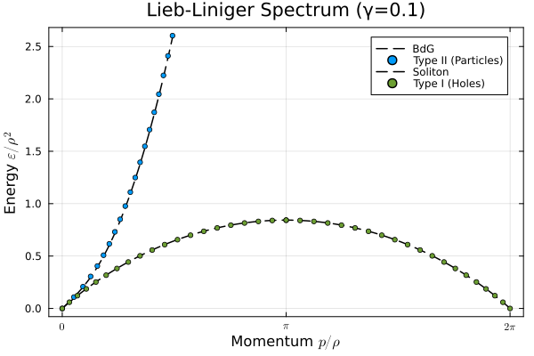

# Lieb-Liniger Bethe Ansatz

This repository has some basic scripts to compute the ground state energy and excitation spectrum of the Lieb-Liniger model in the thermodynamic limit using the Bethe ansatz formalism. Additionally, one may also extract the magnon spectrum for the bosonic Yang-Gaudin model as it shares the same ground state.


## Example 

### Ground state
```julia
# TG limit

# in order, this returns (distribution of quasi-momenta, energy, particle density, Fermi energy)
rho, e, n, Q = get_ground_state(γ=1e8, N=100)
println(norm(e / n^3 - π^2 / 3), " ", Q, " ", rho(0))
plot(rho, range(-Q, Q, 100), ylim=[0, 4.], lab="", lw=4)
```

## Excitations
```julia
# excitations in dilute limit
γ, N = 10, 100
quadrature_rule = midpoint_quadrature
rho, e, n, Q = get_ground_state(γ=γ, N=N, quadrature_rule=quadrature_rule)
p_h, E_h, p_p, E_p = get_particle_hole_spectrum(γ, N=N, quadrature_rule=quadrature_rule, num_points=20)

plot()
Eph(p) = sqrt(4 * γ * n^2 * p^2 + p^4)
plot!(p_p ./ n, Eph.(p_p) ./ n^2, ls=:dash, c=:black, lw=1.5, lab="BdG")
scatter!(p_p ./ n, E_p ./ n^2, label="Type II (Particles)", lw=2, xtick=pitick(0, 2π, 1, mode=:latex), c=1, ms=3)

c = sqrt(4 * γ * n^2)
Esol(v) = (4 / 3) * n * c * (1 - (v / c)^2)^(3 / 2)
psol(v) = 2 * n * (acos(v / c) - (v / c) * sqrt(1 - (v / c)^2))
vs = range(-c, c, 100)

plot!(psol.(vs) ./ n, Esol.(vs) ./ n^2, c=:black, ls=:dash, lw=1.5, lab="Soliton")
scatter!(p_h ./ n, E_h ./ n^2, label="Type I (Holes)", lw=2, title="Lieb-Liniger Spectrum (γ=$γ)", c=0, ms=3)

xlabel!("Momentum " * L"p/ρ")
ylabel!("Energy " * L"\epsilon/ρ^2")
plot!(framestyle=:box)

μ = compute_chemical_potential(c, Q)
println(μ, " ", 2 * n * c)
```
