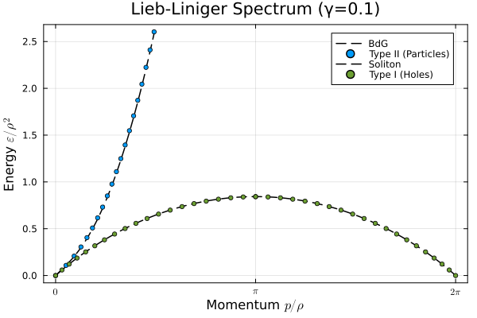

# Lieb-Liniger Bethe Ansatz

This repository has some basic scripts to compute the ground state energy and excitation spectrum of the Lieb-Liniger model using the Bethe ansatz formalism. We adopt the following convention for the Hamiltonian,
$$H = -\sum_{j=1}^{N} \left[\frac{\partial^2}{\partial x_j^2} + 2c\sum_{j<i} \delta(x_j - x_i)]\right$$

where we set $\hbar = 2m = 1$ which may differ from typical conventions used in cold atom physics. Currently there is only basic functionality including computing the ground state energies and densities in the following situations:

- Thermodynamic limit in a uniform system
- Finite system with periodic or hard wall boundaries
- Non-uniform system using a local density approximation

Additionally, the excitation spectrum can be computed for all of the above. A couple of examples with instructive comments can be found in `/scripts`. Density profiles and correlations functions cannot be computed at the moment!

## To-do
- check correctness of LDA and add unit tests
- add function to compute particle density for hard wall system